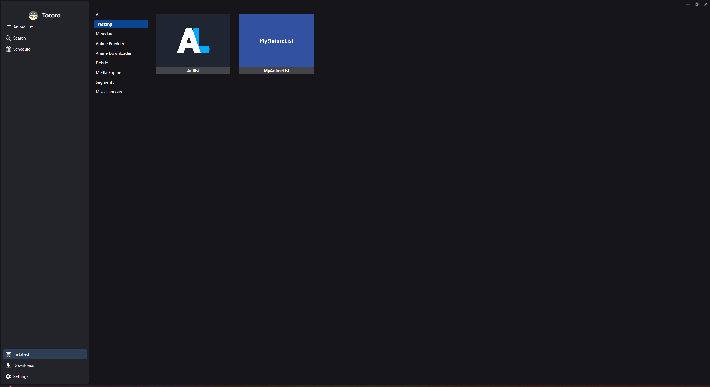
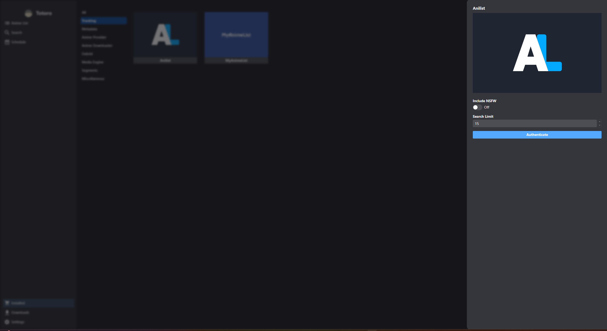
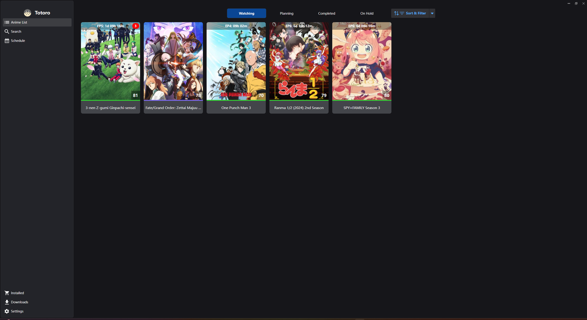
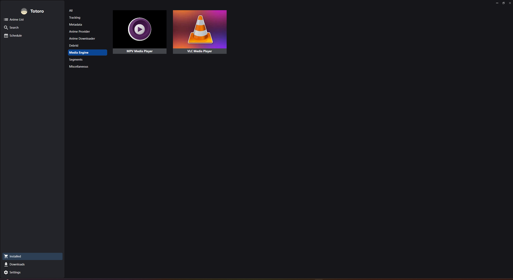
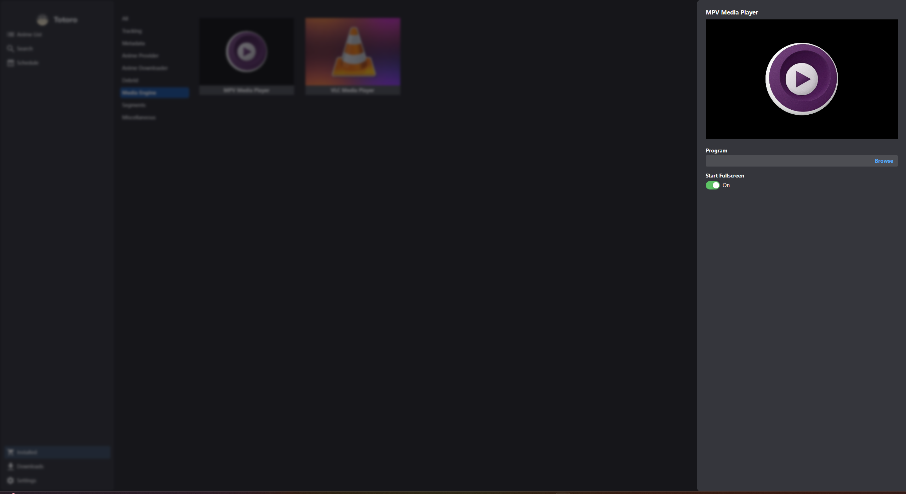
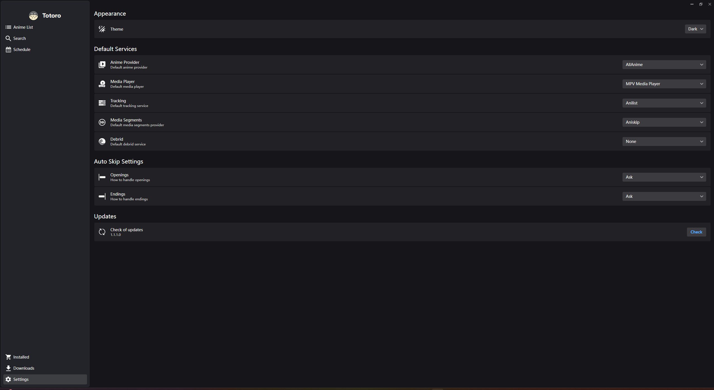
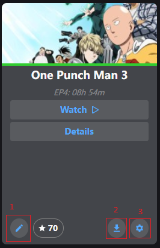

# TotoroNext

This is a spiritual successor of [Totoro](https://github.com/insomniachi/Totoro), one of the issue with Totoro was it
was windows only, this project attempts to
solve this problem by using Avalonia as a ui framework. this allows me to target windows, linux and macOS with a single
codebase.
and potentially android and ios in the future.

I have fully rewritten the entire codebase from scratch, this allowed me to correct some mistakes I made in the original
Totoro project. some of the features in Totoro are not yet implemented in TotoroNext, but I plan to add them in the
future.

In original project things like media player and torrent downloading was part of the main project, in this project I
have
given those responsibilities to popular third party apps like MPV and VLC for media playback and qBittorrent for torrent
downloading (Soon). they'll do a better job at those tasks than I ever could. but this will make the setup process a bit
more complicated than the original Totoro project. but I believe it's worth it in the long run.

## Features

- Cross-platform (Windows, Linux, macOS)
- Track your anime watch progress with MyAnimeList, AniList simultaneously
- Bulk download anime from supporting streaming sites
- Support for multiple streaming sites.
- Skip OP/ED Aniskip, Anime source if they themselves provider or if the video file has chapters.

## Getting Started

- Download the relevant build for your OS from
  the [Releases](https://github.com/insomniachi/TotoroNext-Avalonia/releases/latest)
  (Setup.exe for Windows, and .AppImage for Linux)
- Go to Installed -> Tracking  
  
- Click on MyAnimeList and/or AniList and authenticate your account  
    
  now if you go back to Anime List page, you should see your anime list being loaded  
    
- Now go back to Installed -> Media Engine  
    
  and browser to the location of your media player (MPV or VLC)  
    
- Go to Settings and set up your defaults  
      
- Hovering over an anime in your list should show additional options.  
    
1 - Manually update tracking  
2 - Download episodes  
3 - Mange options specific to that anime like the source to use or auto skip op/ed. if not used default options will be applied  
- Now you're all set to start using TotoroNext!  
  